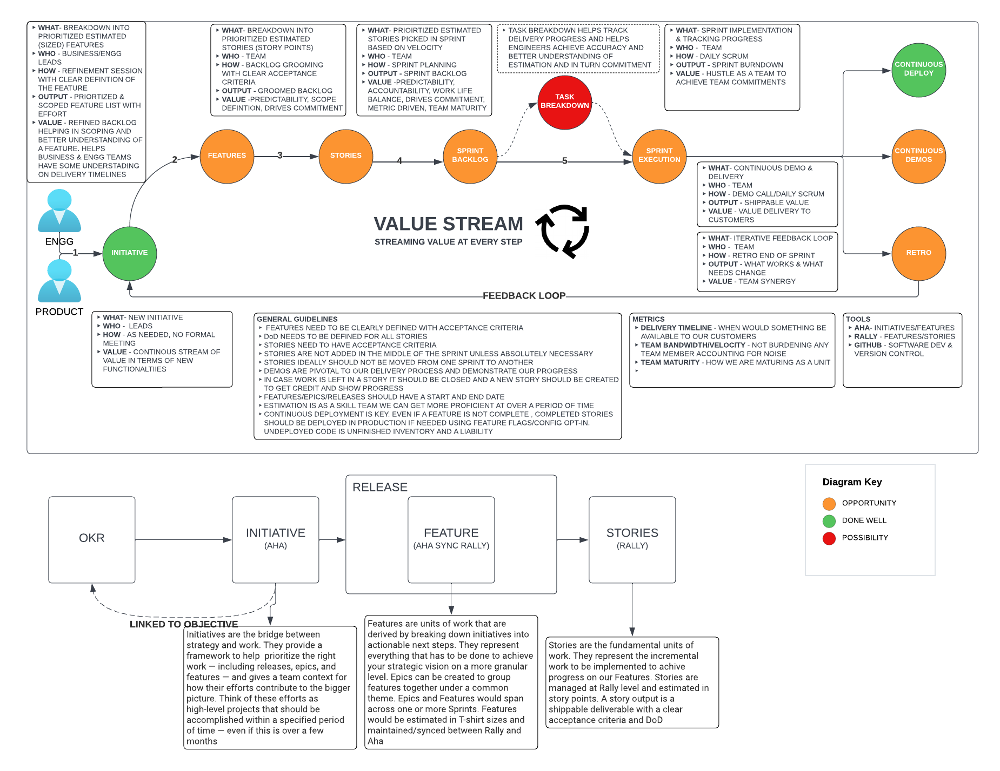
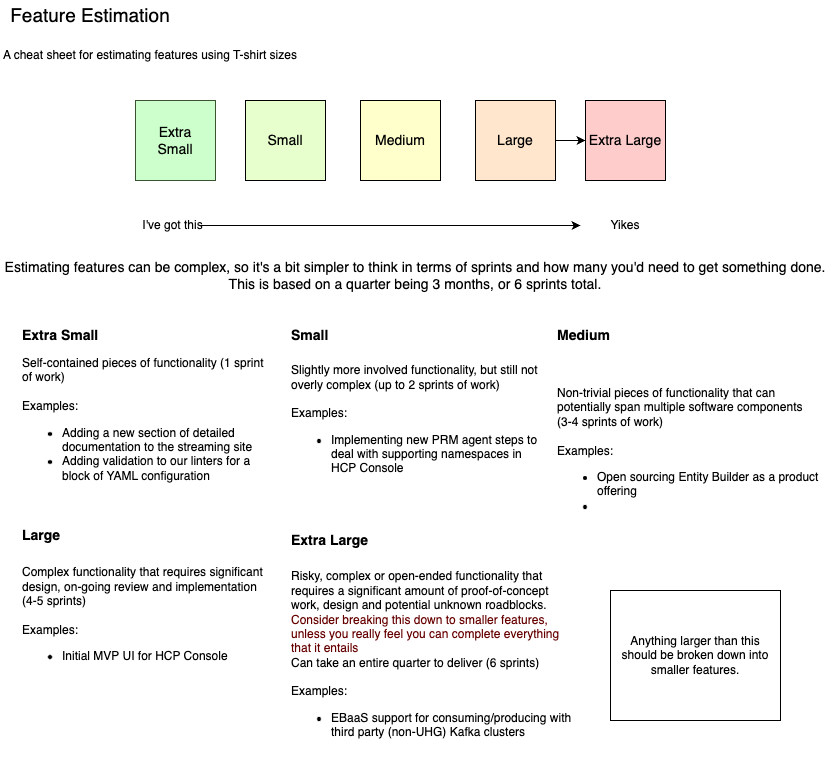
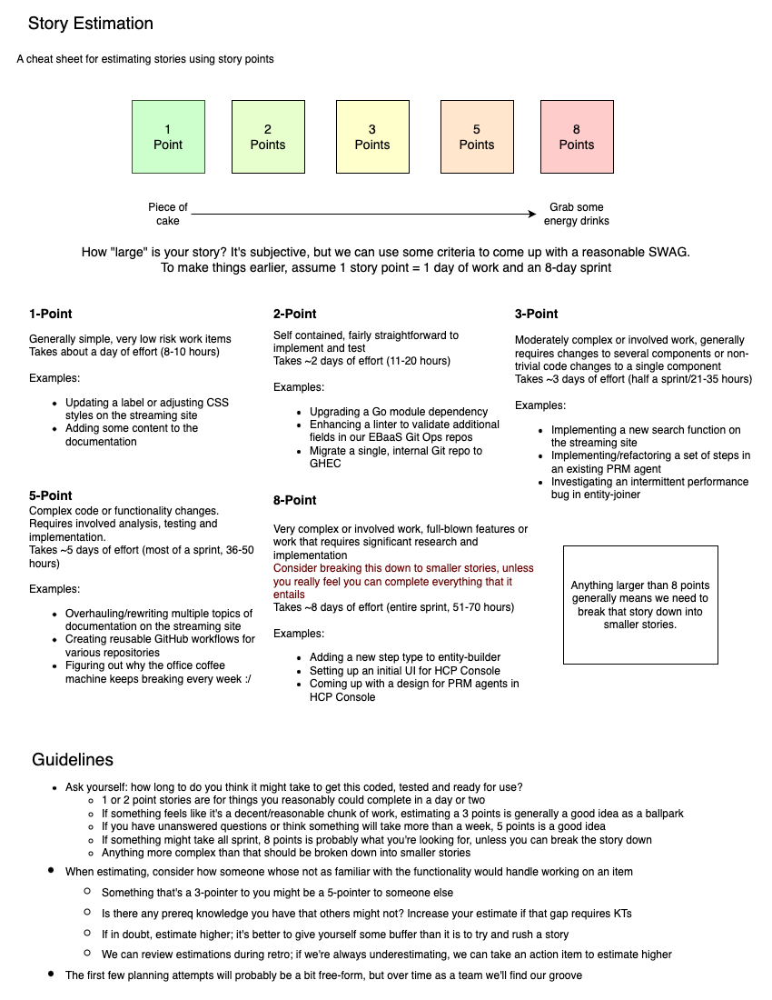

# DDS Agile Delivery Excellence Model (Living Doc)

The intent of this document is to define how we create repeated and predictable value for the business.  

## Why

In today’s competitive fast-paced environment to succeed businesses need to deliver continuous value at speed to customers it serves. Besides the value proposition we also owe it to our end customers coz every change we implement helps deliver on our mission “Helping people live healthier lives and make health system work better for everyone”

 As an engineering organization that enables the business mission, we need to be accountable, predictable, and consistent on our commitments to our business and ultimately our end customers.

 This document serves as a guide and lays down some key principles on inculcating that culture of continuous, predictable, and consistent value-based delivery. These guidelines help us:

1. Be metrics driven
2. Be Iterative
3. Be outcome driven
4. Be predictable in our delivery
5. Be accountable 
6. Be better and grow as a team

## How

This culture can be achieved by streaming continuous value at every step of our engineering delivery agile process. Since we are a streaming platform, we coined the term “Value stream-based delivery”. The Value Stream Model defines how DDS teams deliver value at every step of its delivery process right from ingestion of requirements to a retro completing the feedback loop.

### Tools

**DDS team will utilize following tools for its delivery tracking**

1. AHA - Strategic Planning - Initiatives, Features, Releases
   1. There are 6 namespaces in Aha under team DDS namely 
      1. Entity Builder as a Service
      2. Kafka
      3. CLaaS
      4. Elasticsearch
      5. Change Data Capture
      6. Cassandra
2. Rally - Agile planning - Features, Stories
   1. Features from Aha are synced to Rally as Features. 
   2. There are 5 projects created in Rally 
      1. Distributed Data Services – CDC
      2. Distributed Data Services – EBaaS
      3. Distributed Data Services – Elastic
      4. Distributed Data Services – Kafka
      5. Distributed Data Services – CLaaS *
3. Github – Source Code Management

### Team Organization

TBD

### How we work

The diagram above explains How we work from ingestion of a requirement to delivery. Minimal metrics will be tracked during the process and a lightweight agile methodology will be used with minimal overhead and administrative burden and ceremonies.

**Pre-Sprint Activities, Deliverables and Metrics**

**Step 1 – Initiative, Release & Feature Creation**

1. Product Management team will create the initial initiative in Aha based on the product. 
2. The Initiative will be linked to the Objective
3. Product and Engineering Leads in a monthly/bi-monthly Refinement session break down Initiatives into Features, prioritize those and estimate those. The features will be linked by Releases
4. The Feature can be put into Ready state once estimated
5. Aha Feature will include clear Acceptance Criteria
6. Aha Feature will include clear Prioritization
7. Aha Feature will include clear Estimate (T-shirt sizing) 
8. Aha Feature will include a start date and an end date

**Step 2 – Prioritization & Estimation**

1. Features will be automatically synced into Rally
2. As part of a Monthly/Bi-monthly Grooming session the Team (or lead + key people) will break down the Feature into Stories. The story once created will be in Refining state
3. Rally story will include clear Acceptance Criteria
4. Rally story will include clear Prioritization
5. Rally story will include clear Estimate (Story point)
6. Once above 3 are done the Story changes into ‘Defined’ state

**Guidelines for Feature & Story Sizing:**

**Features**

**Stories**

**Sprint Planning & Execution - Activities & Metrics**

**Step 3 –**

1. During Sprint Planning, the capacity of each team member will be captured
2. During Sprint Planning the User Stories based on priority will be picked up for the Sprint and mapped to capacity to decide the story count
3. Work should be planed up to 85% of Sprint Capacity and excess work to be moved to the next sprint

**Post Sprint – Activities & Metrics**

**Step 4 –**

1. Sprint Demos and Retrospectives conducted
2. Team can track & publish metrics for number of Story Points committed versus actually delivered / accepted by Product Management. 
   1. These can be discussed in Demo calls

## Metrics Captured

The following metrics will be captured and published at various stages of the development lifecycle

| **Metric**                              | **Stage**                    | **Responsibility**    |
| --------------------------------------- | ---------------------------- | --------------------- |
| **T-shirt size**                        | **Backlog Refinement**       | **Product/Engg Lead** |
| **Story point**                         | **Grooming/Sprint Planning** | **Eng Lead**          |
| **Team capacity**                       | **Sprint Planning**          | **Eng Lead**          |
| **No.of points committed vs delivered** | **Sprint Demo/Retro**        | **Eng Lead**          |

## Ceremonies

| **Meeting**          | **Stage**                                 | **Frequency**          | **Stakeholders**                         |
| -------------------- | ----------------------------------------- | ---------------------- | ---------------------------------------- |
| **Refinement**       | **Backlog Refinement – Feature Creation** | **Monthly/Bi-Monthly** | **Product/Eng Lead**                     |
| **Backlog Grooming** | **Grooming/Sprint Planning**              | **Monthly/Bi-Monthly** | **Product + Eng Lead + Key team member** |
| **Sprint Planning**  | **Sprint delivery**                       | **Every 2 weeks**      | **Scrum Team**                           |
| **Sprint Demo**      | **Sprint delivery**                       | **Every 2 weeks**      | **Scrum Team**                           |
| **Sprint Retro**     | **Sprint delivery**                       | **Every 2 weeks**      | **Scrum Team**                           |

## RACI

RACI is a chart that defines who is responsible (R), accountable (A), consulted (C) and informed (I) about a particular item.

| **Deliverable**                                        | **Product Manager** | **Principal** | **Eng** **Leads**  | **Team** |
| ------------------------------------------------------ | ------------------- | ------------- | ------------------ | -------- |
| Initiative  Management                                 | R, A                | I             | C                  | I        |
| Feature  Creation, Estimation & Prioritization in A-Ha | R, A                | C             | C                  | I        |
| Story  Creation, Estimation & Prioritization           | C                   | C             | R, A               | C        |
| Sprint  Planning, Demo & Retro                         | C                   | C             | A                  | R        |
